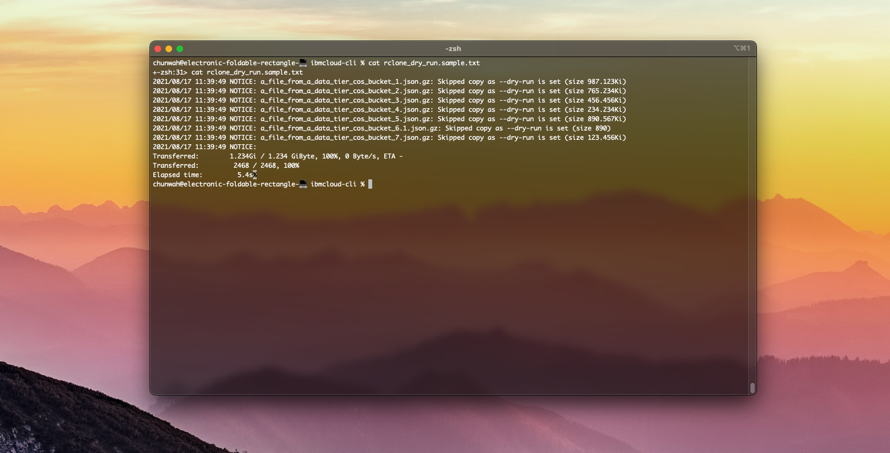

<h1 align="center">
  <br>
  
  <br>
  IBM Cloud Object Storage Backup
  <br>
</h1>

<h4 align="center">A script to run in your Jenkins pipeline to back up <a href="https://cloud.ibm.com/docs/cloud-object-storage" target="_blank">IBM Cloud Object Storage</a> instances.</h4>

<p align="center">
  <a href="#motivation">Motivation</a> •
  <a href="#key-features">Key Features</a> •
  <a href="#usage">Usage</a> •
  <a href="#extra">Extra</a> •
  <a href="#stack">Stack</a> •
  <a href="#resources">Resources</a>
</p>



## Motivation
My DevOps team needed to do backups in order to fulfill Business Continuity and Disaster Recovery (BCDR) requirements.

## Key Features
* Backup COS data from data tier accounts to backup account
* Dry run option for rclone 
* Get COS service instances
* Get COS service credentials
* Get buckets by COS service instance
* Create rclone profiles
* Create service credentials w/ HMAC keys for COS service instances


## Usage


```bash
# Clone this repository
$ git clone https://github.com/chunwahchung/ibm-cos-backup.git

# Install ibmcloud cli (macOS)
curl -fsSL https://clis.cloud.ibm.com/install/osx | sh

# Install ibmcloud cos plugin
ibmcloud plugin install cloud-object-storage -r "IBM Cloud"

# Go into the repository
$ cd ibm-cos-backup

# Run script
$ ./ibm_cos_backup.sh -d your-backup-account-api-key -s your-data-tier-account-api-key 2>&1 | tee ibm_cos_backup.$(date +%m-%d-%Y-%T-%Z).stdout.txt
```

_Note_: The version of bash I'm running is GNU bash, version 3.2.57(1)-release (x86_64-apple-darwin20)


## Extra
### RCLONE configuration
You should have a rclone profile for your source and destination COS service instances.
```bash
[your_profile_name]
type = s3
provider = IBMCOS
env_auth = true
access_key_id = the_access_key_id_for_your_COS_instance
secret_access_key = the_secret_access_key_for_your_COS_instance
endpoint = s3.your-region.cloud-object-storage.appdomain.cloud

```

### IBM COS Endpoints
The following is mentioned in Bucket Configuration under the Endpoints section:
>Whenever possible use a private endpoint. It requires your client service to:
> - a) Not be Cloud Foundry
> - b) Be hosted on the IBM cloud
> Get the best performance free of charge for all traffic."

## Stack

- IBM Cloud Platform
- IBM Cloud Object Storage
- rclone
- Bash
- Jenkins
- Groovy

## Resources
- [IBM Cloud CLI](https://test.cloud.ibm.com/docs/cli?topic=cli-getting-started)
- [IBM Cloud Object Storage](https://cloud.ibm.com/docs/cloud-object-storage)
- [rclone](https://coredns.io/manual/toc/)
- [Creating an API key](https://cloud.ibm.com/docs/account?topic=account-userapikey&interface=ui#create_user_key)
- [Install ibmcloud cli](https://cloud.ibm.com/docs/cli?topic=cli-install-ibmcloud-cli#shell_install)
- [Install ibmcloud cos plugin](https://cloud.ibm.com/docs/cloud-object-storage-cli-plugin?topic=cloud-object-storage-cli-plugin-ic-cos-cli)

---

> My Website [chunwahchung.me](https://www.chunwahchung.me) &nbsp;&middot;&nbsp;
> LinkedIn [chunwahchung](https://www.linkedin.com/in/chunwahchung/)
